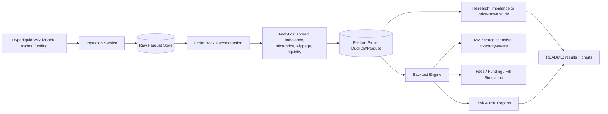
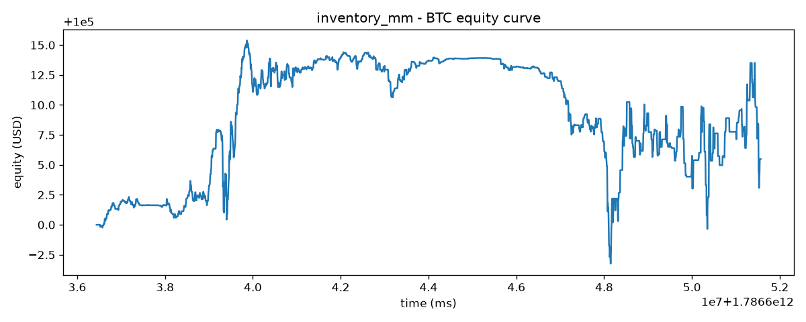

# Hyperliquid Order-Book Research System

> An L2 order-book market-making research stack for Hyperliquid perpetuals: a
> resilient WebSocket capture pipeline, a from-scratch order-book engine, a
> microstructure analytics layer, an inventory-aware market-making simulator
> with an event-driven backtester, and a statistical study of whether
> order-book imbalance predicts short-horizon price moves from 100ms to 10s.

**Research/education only — not investment advice.** See
[Limitations](#limitations) before drawing any conclusions from this repo.

## Architecture



## Quickstart

```bash
git clone https://github.com/tomwalsh07/Hyperliquid-order-book-research-system.git
cd Hyperliquid-order-book-research-system
python3 -m venv .venv
source .venv/bin/activate   # or .venv\Scripts\activate on Windows
pip install -e ".[dev]"
pytest

# collect live data (public market data only, no API keys needed)
python scripts/collect.py --symbols BTC,ETH,SOL --out data/raw/

# normalize raw capture into typed Parquet
python scripts/normalize.py --raw-dir data/raw --out data/processed

# run a backtest report
python scripts/run_backtest.py --strategy inventory_mm --symbol BTC

# run the imbalance -> forward-return research study
python scripts/run_research.py --symbols BTC,ETH,SOL

# browse the results interactively (optional)
pip install -e ".[notebook]"
jupyter notebook notebooks/results_walkthrough.ipynb
```

No secrets are required for any of the above. `.env.example` documents the
only overridable settings, all optional.

## What's implemented

All twelve components below are implemented and tested against real
collected data:

1. **Live order-book WS ingestion** — `src/hlmicro/ingestion/` (async client, raw-first persistence, reconnect/backoff)
2. **Local order-book reconstruction** — `src/hlmicro/orderbook/book.py`
3. **Bid/ask spread** (abs + bps) — `src/hlmicro/analytics/spread.py`
4. **Order-book imbalance** (top-of-book + depth-weighted) — `src/hlmicro/analytics/imbalance.py`
5. **Mid-price + microprice** — `src/hlmicro/analytics/microprice.py`
6. **Funding tracking** (current + predicted, annualized) — `src/hlmicro/analytics/funding.py`
7. **Slippage estimation** (walk-the-book VWAP) — `src/hlmicro/analytics/slippage.py`
8. **Liquidity-change detection** (rolling depth + z-score) — `src/hlmicro/analytics/liquidity.py`
9. **Market-making strategy simulation** — `src/hlmicro/strategies/` (naive symmetric, inventory-aware Avellaneda-Stoikov-adapted)
10. **Event-driven backtesting** — `src/hlmicro/backtest/engine.py`
11. **Inventory risk modeling** — `src/hlmicro/risk/pnl.py`
12. **PnL net of fees, funding, slippage** — `src/hlmicro/backtest/costs.py` + `risk/pnl.py`

Every analytics module has both a streaming/incremental path (for live use)
and a vectorized batch path (for computing across the whole stored
dataset) — see each module's `compute_*_batch` function.

## Headline research finding

**Order-book imbalance is a real, statistically significant predictor of
the direction of the next Hyperliquid order-book update** — consistent
across BTC, ETH, and SOL (Pearson IC ≈ 0.27-0.36, Spearman ≈ 0.33-0.47,
directional hit rate 58-80%, all highly significant on a held-out
chronological test split). **But the edge doesn't survive realistic
trading costs**: net of Hyperliquid's ~9.16bps round-trip taker cost, a
naive threshold-crossing strategy loses money in effectively 100% of
signal events in this sample — the raw edge (typically <2bps, rarely above
6bps) never clears that bar.

A second, unplanned finding shapes how to read the decay curve below:
Hyperliquid's `l2Book` channel pushes updates roughly every **5.4 seconds**
(empirically measured, tight distribution) — so the 100ms/500ms/1s/5s
horizons mostly measure the *same* next-update observation, not
independent points on a smooth decay curve. Only the 10s horizon is
genuinely distinct. This is disclosed directly on the chart below and in
full in [`docs/methodology.md`](docs/methodology.md), which also covers
validation discipline (chronological train/test split, HAC standard
errors, multiple-comparison disclosure) and the complete results table.


## Backtest example

Both market-making strategies produce full reports (fills, PnL, Sharpe,
max drawdown, VaR/ES) against real collected data — see
[`reports/`](reports/) for the JSON summaries and equity curves.



## Limitations

- **L2-only fill simulation**: no true queue position is observable from
  L2 data. The backtester credits a fill only once cumulative trade volume
  at our price crosses a configurable fraction (default 50%) of the
  resting depth when quoted — a documented, conservative heuristic, not
  ground truth. See `src/hlmicro/backtest/fills.py` and
  `docs/methodology.md` §8.
- **Horizon resolution is capped by Hyperliquid's own `l2Book` push
  cadence** (~5.4s median) — see the research finding above and
  `docs/methodology.md` §2 for the full explanation.
- **Live-collection-only dataset**: no S3 historical backfill was used (it
  needs AWS credentials and incurs egress cost). Results reflect a single
  collection window, not a long-run multi-regime sample.
  See `docs/api_notes.md` §8.
- **Adapted, not textbook, Avellaneda-Stoikov**: the inventory-aware
  strategy replaces the model's fixed terminal time with a rolling decay
  window (perpetuals have no natural session end) and drops the
  order-arrival-intensity spread term (not reliably calibrable from this
  data volume) in favor of a documented volatility-scaled heuristic. See
  `src/hlmicro/strategies/inventory_mm.py`.
- **Single fee tier**: base 4.5bps taker / 1.5bps maker throughout — no
  volume or staking discounts modeled.

## Repository layout

```
src/hlmicro/
├── ingestion/    # WS client, raw-first recorder, normalizer
├── orderbook/    # in-memory order book (live path)
├── analytics/    # spread, imbalance, microprice, slippage, liquidity, funding
├── strategies/   # naive + inventory-aware market makers
├── backtest/     # event-driven engine, fill simulation, costs
├── risk/         # PnL accounting, Sharpe/drawdown/VaR/ES
└── research/     # feature/label construction, statistical study
scripts/          # collect.py, normalize.py, run_backtest.py, run_research.py
docs/             # api_notes.md, methodology.md, committed chart assets
tests/            # pytest suite (order book, every analytics formula,
                  # fill-sim edge cases, no-lookahead labels, ...)
```

## License

MIT — see [LICENSE](LICENSE).
