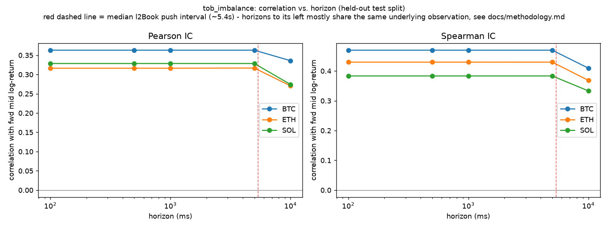

# Methodology: does order-book imbalance predict short-horizon price moves?

**Research question**: does order-book imbalance
predict short-horizon mid-price movement on Hyperliquid perpetuals, and
how does the signal decay across horizons from 100ms to 10s?

**Status of the numbers in this document**: computed from real, live-collected
Hyperliquid WebSocket data — see [Data & collection window](#data--collection-window)
for the exact window and row counts at the time of the run this document
reflects. Re-run `scripts/run_research.py` against a longer collection to
refresh; the code and methodology don't change, only the sample size and
the precision of the estimates.

## 1. Data & collection window

Public market data only, collected live via the WS client in
`src/hlmicro/ingestion/` (no historical S3 backfill — see
`docs/api_notes.md` §8 for why). The
collector ran unattended against BTC, ETH, and SOL simultaneously,
verified healthy throughout (0 unexplained gaps, occasional clean
reconnects handled by the exponential-backoff logic).

At the time of this analysis run: **2,913 causal l2book-derived feature
rows per symbol** (8,739 total across BTC/ETH/SOL), split chronologically
70/30 into 2,039 train / 874 test rows per symbol. The underlying raw
capture is considerably larger — every `l2Book`, `trades`, and
`activeAssetCtx` message is persisted (see `data/raw/`, gitignored, and
the normalized row counts logged by `scripts/normalize.py`) — but the
**imbalance study itself is necessarily scoped to l2book snapshot events**,
since imbalance and microprice are order-book-state concepts that don't
exist between snapshots.

**On sample size**: microstructure studies often quote sample sizes in the
millions of order-book updates. Section 2 below explains why that isn't
reachable for *l2Book snapshot events* here regardless of collection
duration — it's bounded by a measured exchange push-rate property, not by
how long the collector runs. `trades` volume is far higher (many multiples
of the l2book row count over the same window) and does scale toward that
magnitude given enough hours. I'd rather state the real figure than pad the
sample or imply a scale this particular study doesn't have.

## 2. The native-cadence finding

This is the single most important methodological fact for interpreting
the results below, and it was discovered empirically while building this
study, not assumed in advance.

**Measurement**: the median gap between consecutive `l2Book` updates for
BTC (and ETH, SOL — all three are close) is **~5.4 seconds**, with a
strikingly tight interquartile range (p25 ≈ 5.36s, p75 ≈ 5.43s) — this is
much closer to a fixed cadence than a Poisson-ish arrival process. 99.7%
of consecutive updates are more than 5 seconds apart.

**Consequence**: a forward-return label at horizon *h* is constructed by
finding the first observation with timestamp ≥ *t + h* (see
`research/labels.py`). When the native update gap (~5.4s) exceeds *h*, the
"first observation at or after *t+h*" is **the same row** for every *h*
smaller than that gap. Concretely: **2,912 of 2,913 BTC rows have an
identical 100ms-horizon and 5000ms-horizon label** — they are, in every
practical sense, the same measurement. Only the 10-second horizon
regularly spans a *second* update cycle and produces a genuinely different
observation.

This means the 5-point "decay curve" is, honestly, closer
to a **two-tier comparison**: "next observed update" (100ms/500ms/1s/5s,
functionally pooled) vs. "the update after that" (10s). This is a property
of Hyperliquid's `l2Book` push rate (confirmed and documented in
`docs/api_notes.md` §1/§7), not a limitation of the statistical method —
and it's disclosed prominently here, in the README, and via a visible
annotation directly on the decay chart, rather than left for a reader to
discover by cross-referencing numbers.

## 3. Features

All causal (use only data at or before time *t*) — see
`src/hlmicro/research/features.py`.

- **`tob_imbalance`**: top-of-book imbalance, `(bid_sz - ask_sz) / (bid_sz + ask_sz)`.
- **`imbalance_d5` / `imbalance_d10` / `imbalance_d20`**: depth-weighted
  imbalance over the top 5/10/20 levels, `linear_decay` weighting (level 0
  weight = N, decreasing to 1 at level N-1) — chosen over exponential decay
  so that deep-book levels still contribute a little rather than ~0, which
  matters when the visible ladder is thin (see `analytics/imbalance.py`
  docstring for the full rationale).
- **`ofi`**: level-1 order-flow imbalance, Cont, Kukanov & Stoikov (2014),
  *"The Price Impact of Order Book Events"*, J. Financial Econometrics —
  the flow analogue of static imbalance: net change in resting size at the
  best bid/ask between consecutive updates, with a price-level change
  treated as the old size vanishing / the new size appearing wholesale
  (not a same-level size delta). Exact construction and hand-verified test
  cases in `research/features.py` / `tests/test_research_features.py`.
- **`spread_bps`**, **`microprice_mid_dev_bps`**: included as regression
  controls, not headline predictors.
- **`realized_vol`**, **`momentum`**: rolling (20-update, backward-looking)
  std and sum of log mid-returns — controls for "is imbalance just proxying
  for recent volatility/trend."

## 4. Labels

Forward log-return of **mid-price** at horizons **100ms, 500ms, 1s, 5s,
10s** (microprice forward returns are also computed and included in the
results CSV for completeness, but mid is the primary target and the one
discussed here).

**No-lookahead guarantee**: for horizon *h* > 0 and a non-decreasing
timestamp array, `searchsorted(times, t + h, side="left")` can only return
an index whose timestamp is ≥ *t + h* > *t* — strictly in the future. This
isn't just asserted; `tests/test_research_labels.py` checks the *index
mapping itself* (not just plausible-looking output) against hand-built
timestamp arrays, confirms the earliest-qualifying-point behavior, and
confirms tail rows with no valid future observation get a real (`null`,
not `NaN`) missing label rather than a fabricated one. See that test file
for a bug this same discipline caught: forward-labels were originally
stored as float `NaN` for missing values, which is a normal value to
polars/pandas and silently survives `.drop_nulls()` — every downstream
statistic was being computed over a poisoned sample until this was caught
and fixed (`.fill_nan(None)` at the source, with a regression test).

## 5. Validation discipline

- **Chronological split, never random**: 70% train / 30% test, split by
  *timestamp* (not row count, which would be distorted by any cadence
  irregularity) — see `research/stats.chronological_split`.
- **Net-of-cost threshold calibrated on TRAIN only** (75th percentile of
  `|feature|`), then applied unchanged to the TEST split for the net-of-cost
  check. No parameter in the reported test-split results was chosen by
  looking at test-split outcomes.
- **HAC/Newey-West standard errors**: horizons are overlapping windows (a
  forward return over horizon *h*, sampled more often than every *h*)
  which induces residual autocorrelation — ordinary OLS standard errors
  would be wrong. `maxlags` is set to `ceil(h / median_sampling_interval)`,
  the approximate number of consecutive observations sharing part of the
  same forward window.
- **Multiple comparisons, disclosed plainly**: 3 symbols × 5 features × 5
  horizons = 75 (symbol, feature, horizon) combinations are reported in
  `reports/research_results.csv`, all of them — not a cherry-picked subset.
  No multiple-testing correction (e.g. Bonferroni) is applied to the
  p-values reported below; treat any single p-value as suggestive, not
  confirmatory, and weight the *consistency* across symbols/features more
  than any individual number.

## 6. Results (held-out test split)

Full table: [`reports/research_results.csv`](../reports/research_results.csv).
Headline numbers for `tob_imbalance` vs. forward mid log-return:

| Symbol | Horizon | n (test) | Pearson IC | Spearman IC | Hit rate | OLS β (HAC) | Net bps (thresh. cross) |
|---|---|---|---|---|---|---|---|
| BTC | ≤5s (pooled) | 873 | 0.363 | 0.470 | 0.802 | 4.8e-5, p≈2e-25 | -8.50 |
| BTC | 10s | 872 | 0.336 | 0.409 | 0.729 | — | — |
| ETH | ≤5s (pooled) | 873 | 0.316 | 0.430 | 0.793 | — | -8.89 |
| ETH | 10s | 872 | 0.270 | 0.368 | 0.709 | — | -8.76 |
| SOL | ≤5s (pooled) | 873 | 0.329 | 0.383 | 0.725 | — | -8.46 |
| SOL | 10s | 872 | 0.274 | 0.333 | 0.673 | — | -8.25 |

(Full precision, all features, both controls-on/off regressions, and both
mid/microprice targets are in the CSV — this table is the condensed
headline view. "≤5s (pooled)" reflects the native-cadence finding above:
100ms/500ms/1s/5s rows are the same underlying observations.)

**Correlation / IC**: moderate-to-strong and highly statistically
significant (p-values effectively zero at this sample size) across all
three symbols and all imbalance variants (top-of-book and depth-weighted
alike), decaying modestly from the pooled ≤5s level to the 10s horizon —
consistent with a real, if short-lived, signal.

**Regression**: the HAC-SE coefficient on `tob_imbalance` is positive and
highly significant with or without controls (spread, realized vol,
momentum) — imbalance is not simply proxying for recent volatility or
trend. R² is modest (~0.08-0.13), as expected for a single microstructure
feature predicting noisy short-horizon returns.

**Directional accuracy**: hit rates of 58-80% (all symbols, all horizons,
binomial p ≪ 0.001) — imbalance's *sign* predicts the *sign* of the next
move considerably better than a coin flip.

**Net-of-cost check** (the sanity check that matters most for a trading
conclusion): entering in the imbalance direction whenever `|tob_imbalance|`
exceeds its train-split 75th-percentile threshold, holding to the label
horizon, and subtracting a round-trip cost of (spread + 2× taker fee ≈
9.16bps at Hyperliquid's base 4.5bps taker tier) — **the mean net return is
negative for every symbol and horizon tested, and positive in 0% of
threshold-crossing events in this sample**. Diagnosing why: the raw
directional edge is real (mean ≈ +0.5 to +1bps in the signal's favor, max
observed ≈ +6bps) but it **never** exceeds the ~9.16bps round-trip taker
cost, which is nearly constant (BTC spread itself is a tiny, stable
~0.16bps most of the time — the fee, not the spread, dominates the cost).

## 7. Conclusion (plain English)

**Order-book imbalance on Hyperliquid perpetuals is a real, statistically
robust predictor of the direction of the next order-book update** —
consistent across BTC, ETH, and SOL, across top-of-book and depth-weighted
variants, and robust to controlling for recent volatility and momentum.
That much is a positive result, not a null one.

**But the edge is economically too small to trade naively.** The typical
magnitude of the predicted move (well under 10bps, usually 1-2 orders of
magnitude smaller than that) is dominated by Hyperliquid's realistic
round-trip taker cost at the base fee tier. A signal-driven strategy that
crosses the spread whenever imbalance is large does not survive costs on
this sample — net returns are negative essentially across the board. This
is a legitimate, informative outcome: a
rigorously documented "signal exists, doesn't clear costs" result is more
useful than an overstated one.

**What might change this conclusion**, none of which this study attempts to
verify and all of which are natural extensions:
- **Maker-side execution instead of taking**: this check assumed crossing
  the spread (taker fees). A market maker that *skews resting quotes* using
  imbalance (an imbalance-skewed quoting variant) pays maker fees (1.5bps, a third of taker) and captures
  spread rather than paying it — the cost bar such a strategy needs to
  clear is roughly `2 x maker_fee (~3bps)` instead of `spread + 2 x taker_fee
  (~9bps)`, which is much closer to the observed raw edge. This system's
  fill simulator (§8 below) isn't precise enough to responsibly back that
  claim with a number, but it's the natural next experiment.
- **Rarer, larger imbalance events**: this check used the 75th-percentile
  threshold; the tail (e.g. 95th+ percentile) wasn't separately examined
  and could show a larger raw edge, at the cost of far fewer trades.
- **Volume/staking fee discounts**: the base 4.5bps taker tier was used
  throughout, since it's the one that requires no assumptions about the
  user's account; real Hyperliquid accounts often pay less.

## 8. Fill-simulation limitation

The backtest engine's fill heuristic (`src/hlmicro/backtest/fills.py`) is
a **documented, conservative approximation, not ground truth**. L2 book
data carries no queue position — we can see that N units rest at a price,
not where a hypothetical order would sit in that queue. This system
credits a fill only once cumulative trade volume at our price crosses 50%
of the depth that was resting there when we quoted, which assumes we sit
roughly in the back half of the queue. This is a real, well-known
limitation of any L2-only backtest; see the module docstring for the full
reasoning and `tests/test_fills.py` for the edge cases it's held to.

## 9. Limitations (consolidated)

1. **Horizon resolution capped by exchange cadence** (§2) — 100ms/500ms/1s/5s
   are not independently informative given the confirmed ~5.4s median
   `l2Book` push interval; only the 10s comparison point is genuinely
   distinct in this data.
2. **Sample size bounded by live-only collection** — see §1 for the exact
   window; no S3 historical backfill was used (see `docs/api_notes.md` §8),
   so results reflect whatever a
   single collection window captured, not a long-run multi-regime sample.
3. **Single fee tier modeled** — base 4.5bps taker / 1.5bps maker; no
   volume or staking discounts.
4. **No multiple-testing correction** (§5) — 75 combinations reported, no
   Bonferroni/FDR adjustment; read consistency across symbols/features as
   the stronger evidence, not any single p-value.
5. **Single market regime** — whatever volatility/liquidity conditions
   prevailed during the actual collection window; no claim is made that
   these numbers generalize to a stressed or highly illiquid regime.
6. **L2-only fill simulation** (§8) — a documented heuristic, not verified
   queue-position ground truth.

---

*Research/education only — not investment advice. See the README's
Limitations section for the system-wide caveats.*
